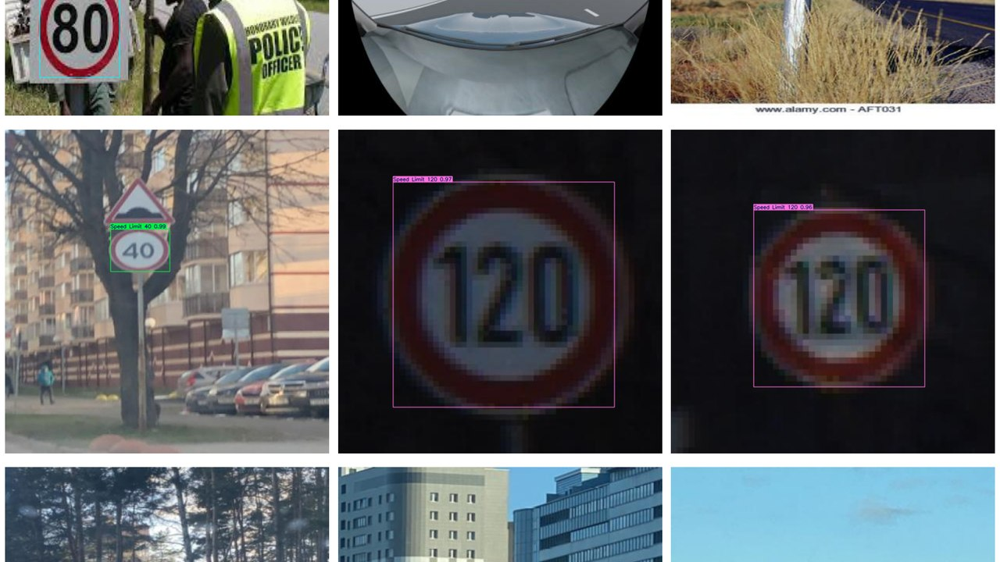

# Detección de señales de tráfico

[](https://skillicons.dev)

Detección y clasificación de señales de tráfico en imagen y vídeo con un modelo YOLOv8 entrenado sobre un dataset de señales de Kaggle.



## Qué hace

- Prueba un YOLOv8 preentrenado y después lo entrena con un dataset de señales de tráfico.
- Valida el modelo con el conjunto de test y hace predicciones sobre imágenes y vídeo.
- Incluye un script aparte que detecta colores y caras en tiempo real con la webcam (OpenCV).

## Cómo ejecutarlo

El notebook está pensado para Google Colab o Kaggle: instala sus dependencias en la primera celda y descarga el dataset.

```bash
# Script de webcam
pip install opencv-python imutils numpy
python reconocimiento.py            # o: python reconocimiento.py --video fichero.mp4
```

## Contenido

| Fichero | Qué es |
|---|---|
| `detección_de_señales_de_tráfico_con_yolov8.ipynb` | Entrenamiento, validación y predicciones con YOLOv8 |
| `reconocimiento.py` | Detección de colores y caras con OpenCV |

---

Proyecto del Grado en Tecnología Digital y Multimedia (UPV). Forma parte de mi [portfolio](https://quique-such.github.io/portafolio/).
